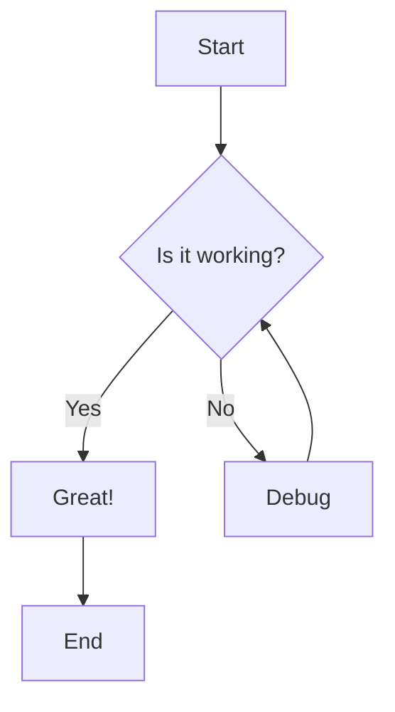
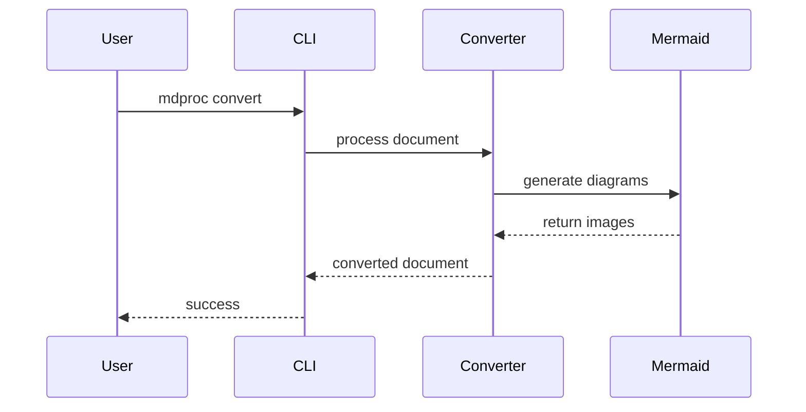
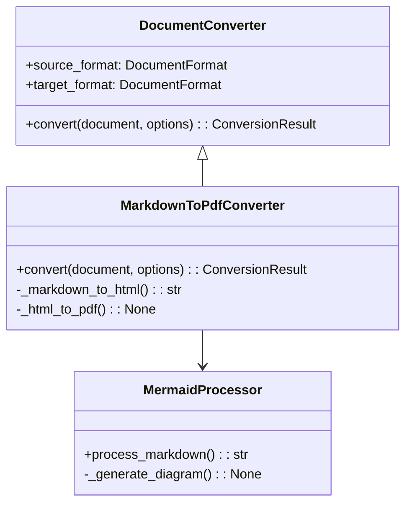
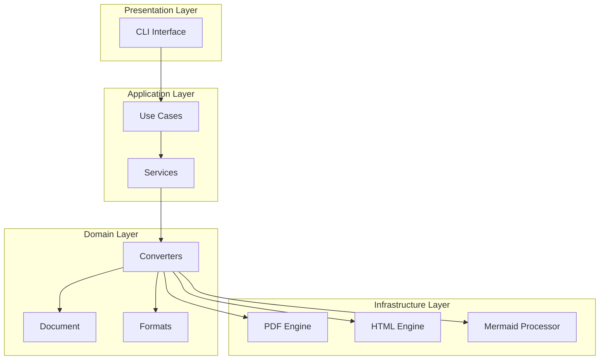

# Mermaid Diagram Test

This document tests Mermaid diagram support in our markdown processor.

## Flowchart Example

## Sequence Diagram

## Class Diagram

## Architecture Overview

This demonstrates how our hexagonal architecture handles Mermaid diagrams:

## Summary

The Mermaid integration allows us to:

1. **Process diagrams** automatically during conversion
2. **Support multiple formats** (PNG for PDF, SVG for HTML)
3. **Maintain clean architecture** with proper separation of concerns
4. **Provide fallback handling** when diagram generation fails

This enhances our document processor significantly for technical documentation!
